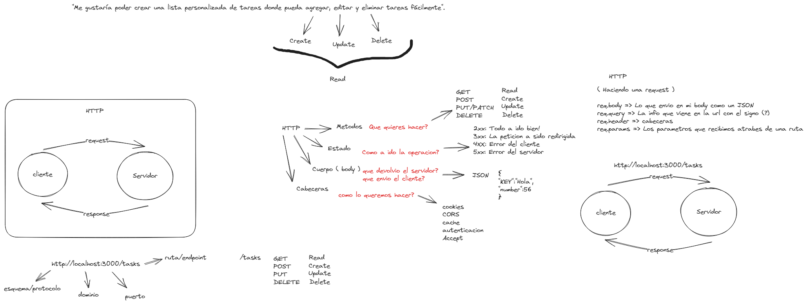

## Obtención de requisitos, implementación preliminar y almacenamiento en memoria

### Objetivos:

- Comprender el proceso de obtención de requisitos funcionales en el contexto de la ingeniería de software.
- Aprender a traducir los requisitos funcionales en código a través de la implementación preliminar de una aplicación sencilla.
- Familiarizarse con el desarrollo de aplicaciones en Node.js y Express.
- Familiarizarse con el concepto del CRUD (Create, Read, Update, Delete) y su implementación en una aplicación web.

### Enunciado desde la perspectiva del cliente:

- Estoy buscando una aplicación llamada 'TODO App' que me ayude a administrar mis tareas diarias. Me gustaría poder crear una lista personalizada de tareas donde pueda agregar, editar y eliminar tareas fácilmente. Cada tarea debería tener un título descriptivo y la opción de añadir más detalles si es necesario. También sería genial si puedo marcar una tarea como completada una vez que la haya terminado. Ah, y si la aplicación me permite establecer recordatorios con fechas de vencimiento para las tareas, sería perfecto. Sería muy útil poder filtrar las tareas para ver las completadas, las pendientes y todas juntas. Ah, y por supuesto, quiero asegurarme de que mis datos sean seguros, así que necesitaré una forma de iniciar sesión con un nombre de usuario y una contraseña. En resumen, necesito una aplicación fácil de usar que me ayude a organizar y realizar un seguimiento de mis tareas diarias.

### Ejercicios:

- Obtenga los requisitos funcionales del sistema a partir del enunciado anterior.
  - Escriba en formato: 
    - `Como <rol> quiero <requisito> para <objetivo>`
      - Ejemplo: "Como usuario quiero poder iniciar sesión para acceder a la aplicación"
    - `El sistema debe permitir <requisito> para <objetivo> porque <justificacion>`
      - Ejemplo: "El sistema debe permitir iniciar sesión para acceder a la aplicación porque es necesario para acceder a las funcionalidades de la aplicación"
- Implemente una aplicacion web backend con Node.js y Express que cumpla con los requisitos funcionales obtenidos.
  - Almacene los datos en memoria (no es necesario utilizar una base de datos).
  - No es necesario implementar la interfaz de usuario

# [Codigo de la clase](./guia)

___
- [Volver atras](../README.md)
