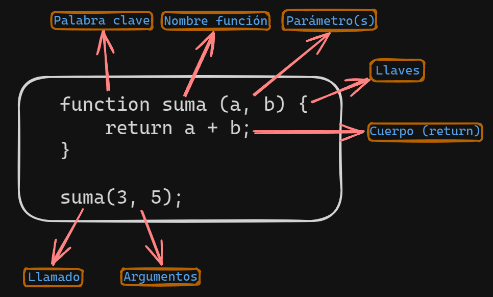

## Funciones

### Anatomía de una función

Una función son porciones de código que nos permiten escribir funcionalidades para poder utilizarlas más de una vez.



### Funciones declarativas

También conocidas como "funciones con nombre" o "funciones tradicionales", se definen usando la palabra clave function seguida por un nombre y un cuerpo de función.

```javascript
function sumar(a, b) {
    return a + b;
}
```

### Expresión de función

Se define asignando una función a una variable.

```javascript
const resta = function(a, b) {
    return a - b;
}
```

### Funciones flecha

Introducidas en ECMAScript 6, son una forma más concisa de escribir funciones. Se definen utilizando una sintaxis de flecha =>.

```javascript
const multiplicar = (a, b) => {
    return a * b;
}
```

### Funciones en objetos

Las funciones también pueden ser propiedades de un objeto.

```javascript
const objeto = {
    nombre: "Juan",
    saludar: function() {
        console.log("Hola, soy " + this.nombre);
    }
}
```