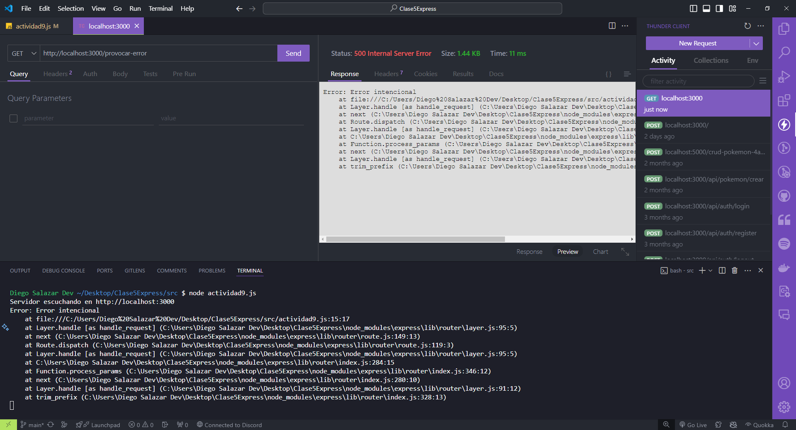

## Manejo de errores

### Manejo de errores con Express.js

Requisitos:

- Tener instalado **Visual Studio Code**.
- Dentro de **Visual Studio Code** instalar la extensión llamada **Thunder Client**.
- Tener instalada la versión actualizada de **Node.js 20.11.0 LTS.**
- Tener las ganas de aprender y programar! 🚀🚀🚀

### Código

```javascript
import express from 'express';

const app = express();
const port = 3000;

app.use((err, req, res, next) => {
  console.error(err.stack);
  res.status(500).send('Algo salió mal');
});
  
app.get('/provocar-error', (req, res, next) => {
  const error = new Error('Error intencional');
  next(error);
});
  
// Metodo de express para levantar un servidor y que escuche en un puerto determinado.
app.listen(port, () => {
    console.log(`Servidor escuchando en http://localhost:${port}`);
})
```

### Resultados al realizar la petición con Thunder Client a la ruta http://localhost:3000/provocar-error

- Se debe levantar el servidor antes con el comando: `node <nombreArchivo.js>`.

