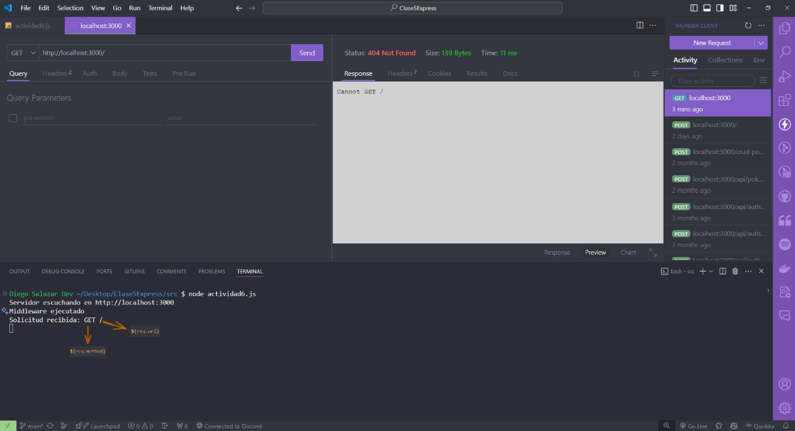

## Middleware básico

### Middleware básico con Express.js

Requisitos:

- Tener instalado **Visual Studio Code**.
- Dentro de **Visual Studio Code** instalar la extensión llamada **Thunder Client**.
- Tener instalada la versión actualizada de **Node.js 20.11.0 LTS.**
- Tener las ganas de aprender y programar! 🚀🚀🚀

### Código

```javascript
import express from 'express';

const app = express();
const port = 3000;

app.use((req, res, next) => {
    console.log('Middleware ejecutado');
    next(); // Pasar al siguiente middleware o ruta
  });
  
app.use((req, res, next) => {
    console.log(`Solicitud recibida: ${req.method} ${req.url}`);
    next();
});
  
// Metodo de express para levantar un servidor y que escuche en un puerto determinado.
app.listen(port, () => {
    console.log(`Servidor escuchando en http://localhost:${port}`);
})
```

### Resultados al realizar la petición con Thunder Client a la ruta http://localhost:3000/

- Se debe levantar el servidor antes con el comando: `node <nombreArchivo.js>`.

