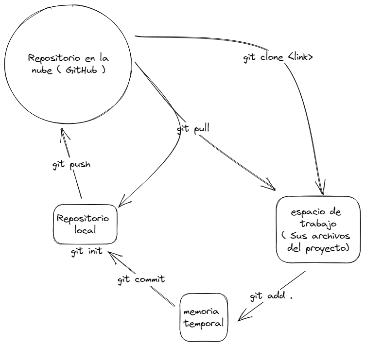

## Fundamentos de Git

### ¿Que es Git?

- Git es un controlador de versiones
- Permite guardar el historial de cambios de un proyecto
- Permite trabajar en equipo de manera colaborativa localmente

### ¿Que es GitHub?

- GitHub es una plataforma que permite alojar repositorios de Git pero en la nube
- Permite trabajar en equipo de manera colaborativa en la nube
- Guarda repositorios públicos y privados

## Que es un repositorio?

- Es un directorio que contiene todos los archivos de un proyecto
- Cada repositorio tiene un historial de cambios

## Como funciona Git?

- Git guarda el historial de cambios de un proyecto en un directorio llamado `.git`
- Cada vez que se realiza un cambio en el proyecto, Git guarda una copia de los archivos en el directorio `.git`
- Cada copia se le conoce como `commit`
- Cada `commit` tiene un identificador único llamado `hash`, nombre del autor, fecha y hora del cambio
- Cada `commit` tiene un mensaje asociado que describe los cambios realizados
    - Ejemplo: `git commit -m "Agrega el archivo index.html"`
    - Si mostramos el commit con `git log --oneline` veremos algo como esto:
        - ejemplo del log: `av75s9a Agrega el archivo index.html`
- Pero, antes de guardar un `commit` en el directorio `.git`, Git lo guarda en el área de preparación ( memoria temporal )
- El área de preparación es un directorio que contiene los archivos que se van a guardar en el próximo `commit`
- Para guardar los cambios en el próximo `commit` debemos ejecutar el comando `git commit` ( como el flujo de la imagen de abajo )

- Para trabajar en equipo, cada persona debe tener su propia copia del repositorio
- Para sincronizar los cambios entre los repositorios, debemos ejecutar el comando `git push` para subir los cambios al repositorio remoto
- Para descargar los cambios de un repositorio remoto, debemos ejecutar el comando `git pull`

- Pero, para tener una copia del repositorio remoto, debemos clonarlo: 
    - Para clonar un repositorio remoto, debemos ejecutar el comando `git clone <url del repositorio remoto>`
    - Ejemplo: `git clone https://github.com/UBB-IECI/Ayudantia-MDD-2023-1.git`
    - Esto creará una copia del repositorio en el directorio actual

## Comandos: ( Revisar la imagen de arriba )

- Comandos basicos:
  - `git init`: Inicializa un repositorio en el directorio actual
  - `git status`: Muestra el estado actual del repositorio
  - `git add`: Agrega archivos al área de preparación ( memoria temporal )
  - `git commit`: Guarda los cambios en el repositorio
  - `git log`: Muestra el historial de cambios del repositorio
  - `git diff`: Muestra las diferencias entre los archivos del repositorio y el área de preparación ( memoria temporal )

- [Volver atras](../README.md)